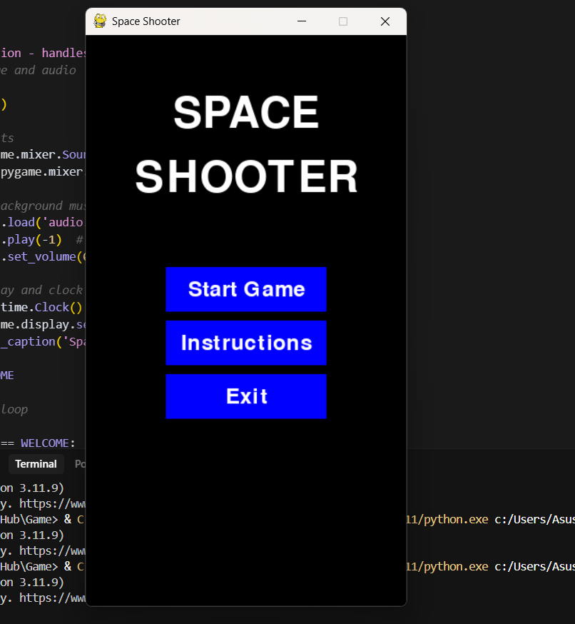

# 🚀 Space Shooter

**Space Shooter** to gra 2D napisana w Pythonie z użyciem biblioteki Pygame. Gracz steruje statkiem kosmicznym, unika przeszkód i zestrzeliwuje wrogów, zdobywając punkty i próbując przetrwać jak najdłużej.

